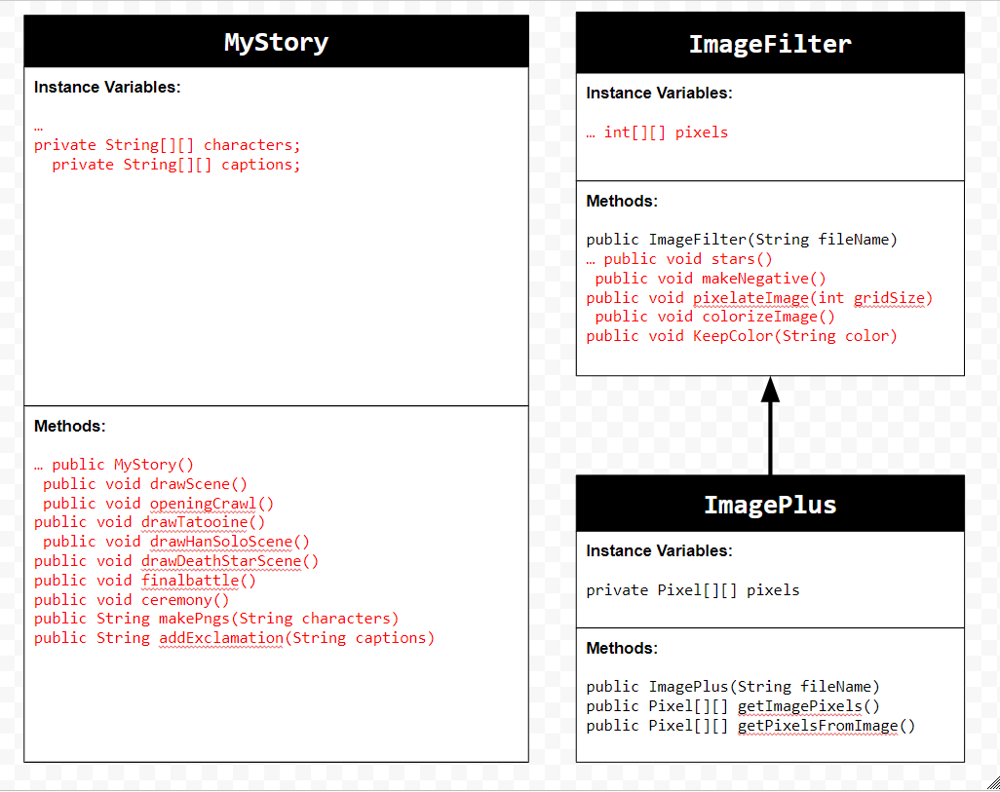
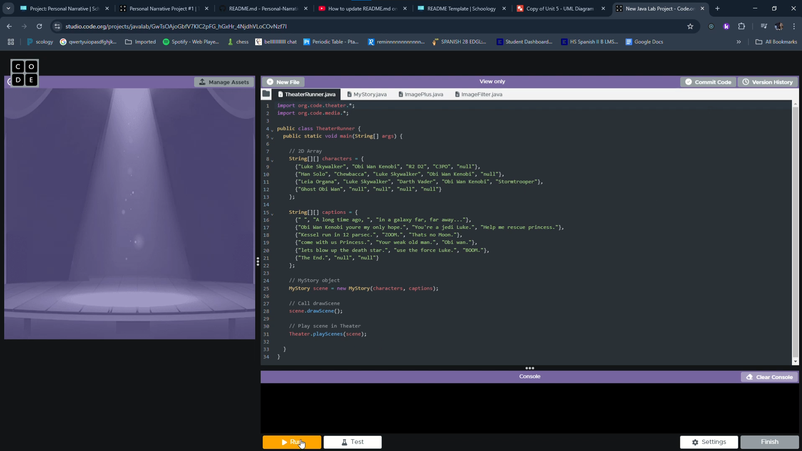

# Unit 4 - Personal Narrative

## Introduction

Images are often used to portray our personal experiences and interests. We also use image filters and effects to change or enhance the mood of an image. When combined into collages and presentations, these images tell a story about who we are and what is important to us. Your goal is to create a personal narrative using The Theater that consists of images of your personal experiences and/or interests, incorporates data related to these experiences and/or interests that can be organized in a 2D array, and uses image filters and effects to change or enhance the mood of your images.

## Requirements

Use your knowledge of object-oriented programming, two-dimensional (2D) arrays, and algorithms to create your personal narrative collage or animation:

- **Create at least two 2D arrays** – Create at least two 2D arrays to store the data that will make up your visualization.
- **Implement one or more algorithms** – Implement one or more algorithms that use loops and two-way or multi-selection statements with compound Boolean expressions to analyze the data.
- **Use Image Filters** - Include multiple image filters learned from this unit, and additionally create new ones of your own.
- **Use methods in the String class** – Use one or more methods in the String class in your program, such as to determine whether the name of an image file contains specific characters.
- **Create a visualization** – Create an image or animation that conveys the story of the data by illustrating the patterns or relationships in the data.
- **Document your code** – Use comments to explain the purpose of the methods and code segments and note any preconditions and postconditions.

## UML Diagram

## Video

Record a short video of your story to display here on your README. You can do this by:

- Screen record your project running on Code.org.
- Upload that recording to YouTube.
- Take a thumbnail for your image.
- Upload the thumbnail image to your repo.
- Use the following markdown

https://youtu.be/66VD0CpSl-0

## Story Description

For my story I decided to reanact StarsWars a New hope but inside Code.org. This goes through an abridged version of the movie showing what I thought were the most important parts of the first movie. It starts out with Luke Skywalker asks for help from Obi Wan to save a princess. It ends when Luke Skywalker blows up the death star with Ghost Armour Stand. For my 2D arrays I created a String array with all the characters, with the rows showing which characters appear in each scene. For the other array I created, it has all of the dialouge for each scene.
## Image Filter Analysis

2 Filters that I used in my project are the stars method, and the make Negative method. The Stars method sets random pixels on the image to white. It does this by picking a pixel and using the Math.random method to create get a ranodm row and col. At this new random pixel it sets all the color values to the max so the pixel turns white so it looks like stars. My other method was the makeNegative method by iterating through the pixels of the image and subtracting 255 for the red, green, and blue values of the pixel and sets the pixel to the absolute values of the new rgb values. This makes all of the dark areas light and light areas dark.